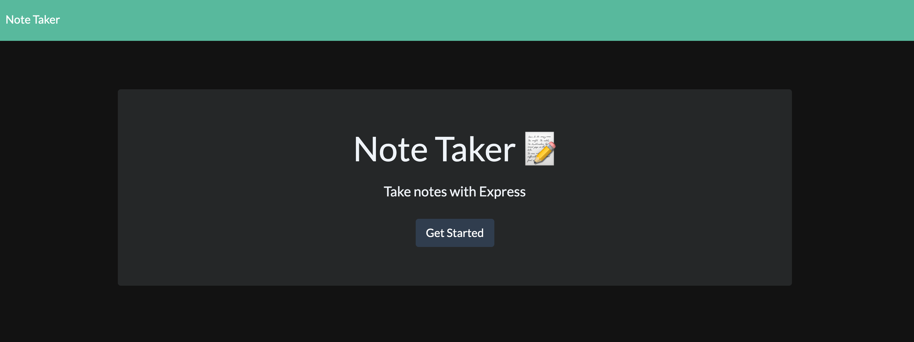
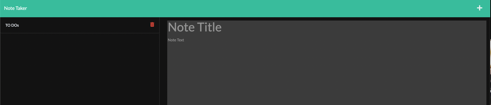
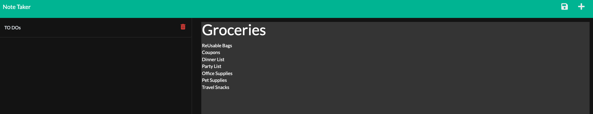

# Do That Note Taker

## Description
Note-taking application that allows users to make and save notes.

## Table of Contents
  - [Usage](#usage)
  - [Tests](#tests)
  - [Installation](#installation)
  - [Contributing](#contributing)
  - [Questions](#questions)

  - [License](#license)
      

## Usage
Saved notes appear on the left side of the screen. New notes may be created and saved by filling in the fields available on the right column. Soon: notes may be deleted as they are completed!

GIVEN a note-taking application
WHEN I open the Note Taker
THEN I am presented with a landing page with a link to a notes page
WHEN I click on the link to the notes page
THEN I am presented with a page with existing notes listed in the left-hand column, plus empty fields to enter a new note title and the note’s text in the right-hand column
WHEN I enter a new note title and the note’s text
THEN a Save icon appears in the navigation at the top of the page
WHEN I click on the Save icon
THEN the new note I have entered is saved and appears in the left-hand column with the other existing notes
WHEN I click on an existing note in the list in the left-hand column
THEN that note appears in the right-hand column
WHEN I click on the Write icon in the navigation at the top of the page
THEN I am presented with empty fields to enter a new note title and the note’s text in the right-hand column

## Tests
test folders labeled for testing the code using $ node test 

## Screenshots

## Video Tutorial
https://watch.screencastify.com/v/NGccOeysTAmU9xSey01E

## Installation
Frontend:
https://calm-castle-27388.herokuapp.com/ 

Middle $ Backend:
Set up the server (using node.js) express.js 
    $ npm i -y  
    $ npm i express 
    
    To use the uuid: 
    $ npm i uuid 

    To run server:
    $ npm start
        then enter in browser: Http://localhost:3001

    To stop server:
    $ ^C

## Contributing
Contact me for more information.

## Questions

Have questions?
You can find me on GitHub:
https://github.com/BeKind-Rewind

Or email me at:
Challenge641@gmail.com

## License

Licensed under the [MIT](https://choosealicense.com/licenses/mit/) license.
    